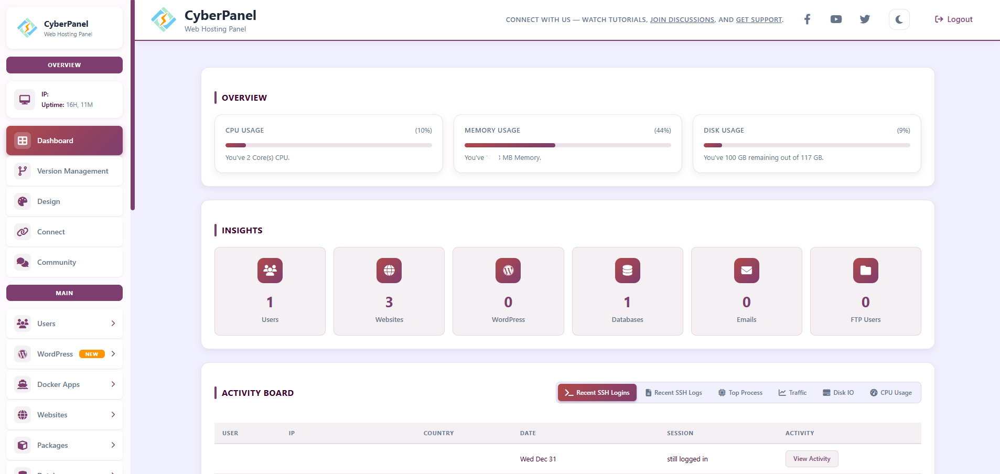
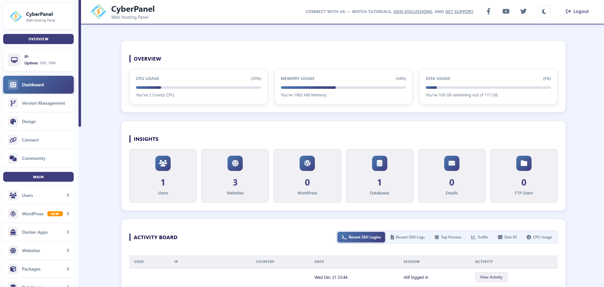
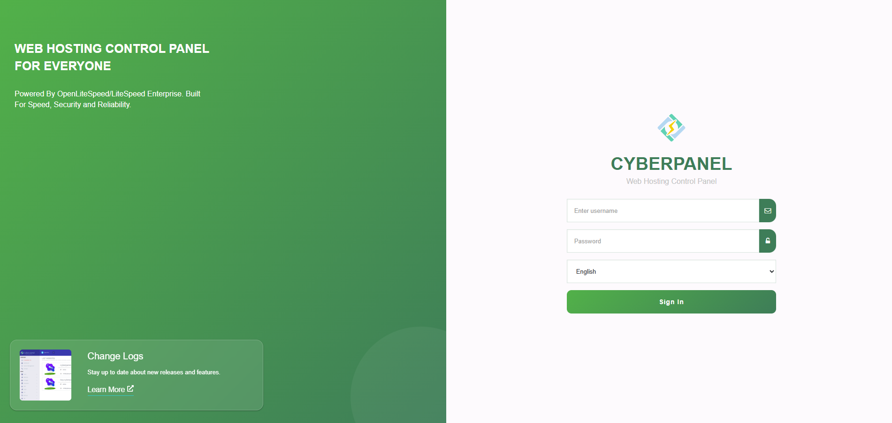

# VJ Themes v2.0 for CyberPanel

Modern, unified themes for CyberPanel with automatic Light/Dark mode support.

> **Tested on:** CyberPanel 2.4 build 4

---

## ✨ Features

- **Unified Design** - Single CSS file works for both Login page and Dashboard
- **Automatic Light/Dark Mode** - Themes adapt based on CyberPanel's theme toggle
- **Modern UI** - Flat design, glassmorphism effects, and smooth transitions
- **Full Dark Theme** - Complete dark experience in both modes

---

## 🎨 Available Themes

### VJ Purple Theme
Premium purple gradient with rose accents.




```
CSS/VJ-Theme-Purple-v2.css
```

---

### VJ Blue Theme
Deep blue professional look.




```
CSS/VJ-Theme-Blue-v2.css
```

---

### VJ Green Theme
Fresh forest green design.




```
CSS/VJ-Theme-Green-v2.css
```

---

### VJ Dark Theme
Full dark experience - Standard Dark in Normal Mode, Deep Dark/AMOLED in Dark Mode.


```
CSS/VJ-Theme-Dark-v2.css
```

---

## 📦 Installation

1. Go to **CyberPanel > Design**
2. Copy the contents of your preferred theme CSS file
3. Paste into the Custom CSS text area
4. Click **Save**
5. Clear your browser cache if needed

---

## 🗑️ How to Remove

1. Go to **CyberPanel > Design**
2. Delete all content from the Custom CSS text area
3. Click **Save**

---

## 🔧 Troubleshooting

- **Theme not applying?** Clear your browser cache (Ctrl+Shift+R)
- **Dark mode not working?** Ensure you're using CyberPanel 2.4+ with theme toggle support

---

## 📁 Legacy Themes (v1)

The original v1 themes are still available in the `CSS/` folder but are not recommended for new installations.

---

## 👤 Author

**VJRanga** (CloudyCode)

---

## 📝 Credits

CyberPanel by [usmannasir](https://github.com/usmannasir)
