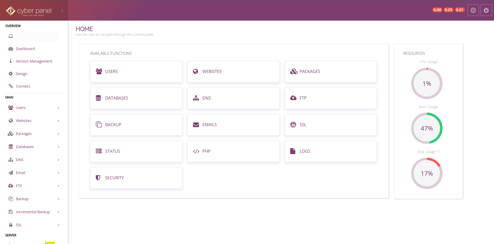
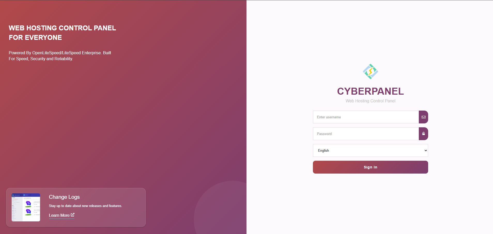
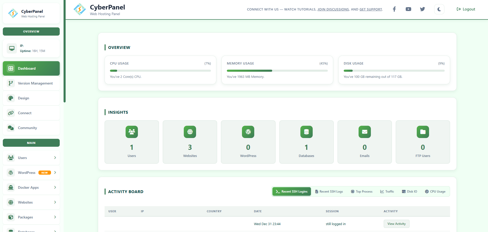
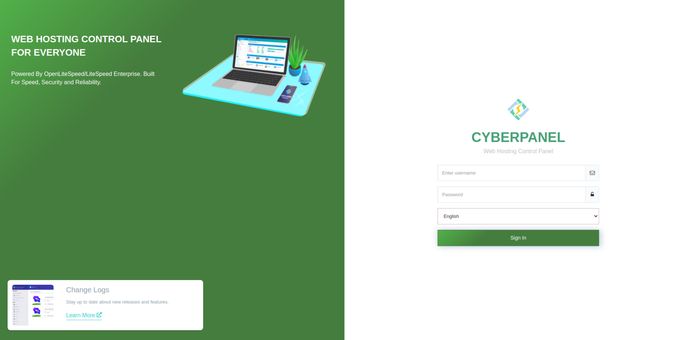

# CyberPanel-VJ-Theme
Simple CyberPanel Theme

### CyberPanel-VJ-Theme-Purple

 

  

### CyberPanel-VJ-Theme-Blue

 

  

### CyberPanel-VJ-Theme-Green

 

  

### How to Install

Go to CyberPanel > Design  
Paste the contents of css to the text area.
Save.
